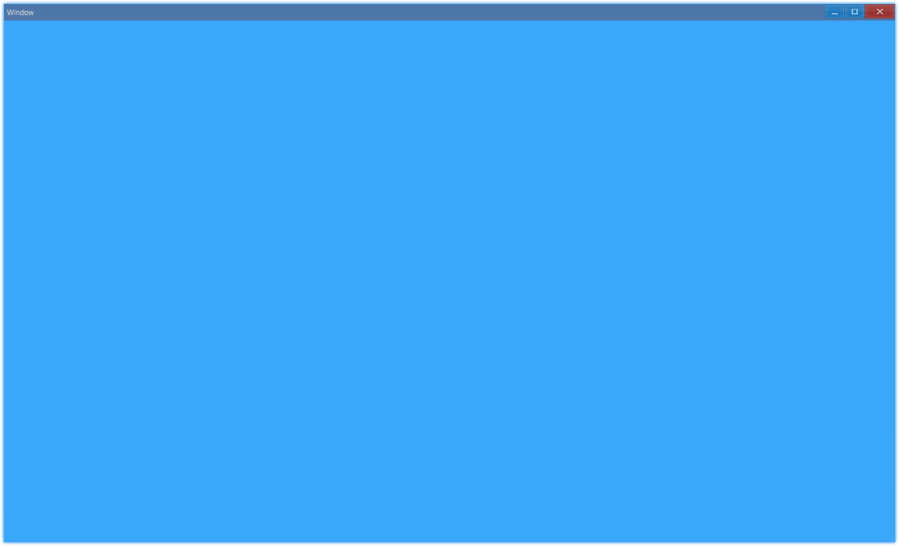

The solution of layout in Ave is Grid, we put all controls in grid, so this document begins with it.

The concept of grid is almost the same as that in [A Complete Guide to Grid](https://css-tricks.com/snippets/css/complete-guide-grid/), the difference is that the implementation in Ave is more flexible.

## Examples {#examples}

### Background Color {#example-grid-background}

```ts {5,6}
import { Window, Grid, Vec4 } from 'ave-ui';

export function main(window: Window) {
    const grid = new Grid(window);
    const lightBlue = new Vec4(0, 146, 255, 255 * 0.75);
    grid.SetBackColor(lightBlue);
    window.SetContent(grid);
}
```

In Ave, we use `Vec4` class to represent color, the range of each component(rgba) is `[0,255]`.

Use `SetBackColor` to set background color:



#### API {#api-background}

```ts
export interface IGrid extends IControl {
    SetBackColor(vColor: Vec4): Grid;
    GetBackColor(): Vec4;
}
```

### Add Control {#example-grid-add-control}

```ts {5,6,12}
import { Window, Grid, Vec4 } from 'ave-ui';

export function main(window: Window) {
    const container = new Grid(window);
    container.ColAddSlice(1, 1, 1);
    container.RowAddSlice(1, 1, 1);

    const center = new Grid(window);
    const lightBlue = new Vec4(0, 146, 255, 255 * 0.75);
    center.SetBackColor(lightBlue);

    container.ControlAdd(center).SetGrid(1, 1, 1, 1);
    window.SetContent(container);
}
```

In this example, we create a 3x3 grid and place another grid at the center:


`RowAddSlice`/`ColAddSlice` is used to add row/column, `slice` makes it responsive, as shows below:


#### API {#api-add-control}

```ts
export class Grid implements IGrid {
	// Add row, arg in x is ratio
	RowAddSlice(...x: number[]);
	ColAddSlice(...x: number[]);

	// Add row, but the arg in x is not ratio, it's dpx
	RowAddDpx(...x: number[]);
	ColAddDpx(...x: number[]);

	RowAddPx(...x: number[]);
	ColAddPx(...x: number[]);
}

export interface IGrid {
	ControlAdd(control: IControl): IGridControl<IControl>;
}

export interface IGridControl<T extends IControl = IControl> {
    // place control in x column y row, takes xspan columns and yspan rows
	// by default, size of control will be the same as the grid
	SetGrid(x: number, y: number, xspan = 1 yspan = 1): IGridControl<T>;
};
```
