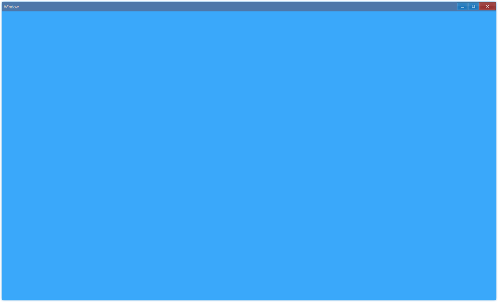

## 安装

```bash
> npm i ave-ui
```

## 开发概要 {#hello-window}

为了介绍使用 Ave 开发，代码大致是怎样的，我们以这个最简单的项目为例：

> 模板项目[docs/getting-started](https://github.com/qber-soft/Ave-Nodejs-Template/tree/docs/getting-started)分支

```ts title="https://github.com/qber-soft/Ave-Nodejs-Template/blob/docs/getting-started/src/index.ts"
import { App, WindowCreation, Window, WindowFlag, Grid, Vec4 } from 'ave-ui';

const app = new App();
globalThis.app = app;

const cpWindow = new WindowCreation();
cpWindow.Title = 'Window';
cpWindow.Flag |= WindowFlag.Layered;

const window = new Window(cpWindow);
globalThis._window = window;

window.OnCreateContent((sender) => {
    const grid = new Grid(sender);
    grid.SetBackColor(new Vec4(0, 146, 255, 255 * 0.75));
    sender.SetContent(grid);
    return true;
});

if (!window.CreateWindow()) process.exit(-1);

window.SetVisible(true);
window.Activate();
```

运行成功后会弹出一个窗口，背景为浅蓝色：



让我们看看这个程序需要哪些代码，首先我们需要创建一个 App 对象：

```ts {4}
import { App, WindowCreation, Window, WindowFlag, Grid, Vec4 } from 'ave-ui';

const app = new App();
globalThis.app = app;
```

这里我们需要将它挂在全局对象上，目的是为了防止 gc（garbage collection，垃圾回收）。随后我们创建了一个 window 对象：

```ts {2,6}
// cp: creation param
const cpWindow = new WindowCreation();
cpWindow.Title = 'Window';
cpWindow.Flag |= WindowFlag.Layered;

const window = new Window(cpWindow);
globalThis._window = window;
```

之后是设置一个回调，我们绘制界面的代码都会写在这个回调里：

```ts
window.OnCreateContent((sender) => {
    const grid = new Grid(sender);
    grid.SetBackColor(new Vec4(0, 146, 255, 255 * 0.75));
    sender.SetContent(grid);
    return true;
});
```

接下来是实际创建窗口，如果失败我们就退出程序，成功就让它显示出来：

```ts
if (!window.CreateWindow()) process.exit(-1);

window.SetVisible(true);
window.Activate();
```

创建窗口后，就可以根据各组件的文档来组合打造成桌面应用了。

## 模板项目 {#template-project}

我们提供了模板项目用于快速开发：[Ave-Nodejs-Template](https://github.com/qber-soft/Ave-Nodejs-Template)。

它演示了按钮的基本使用方法：

<video src={require('./assets/getting-started-template-project.mp4').default} controls autoplay style={{width: 800}}/>
